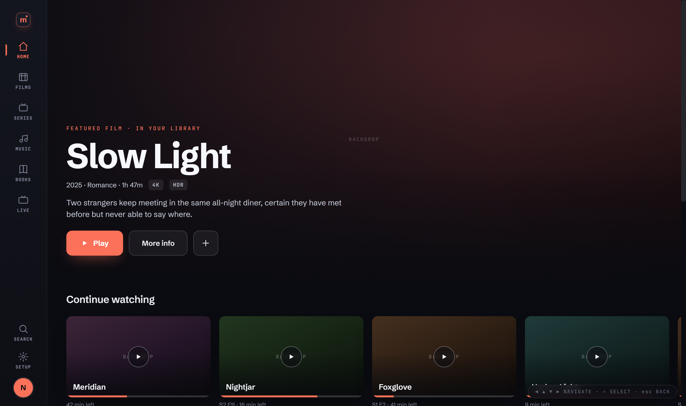
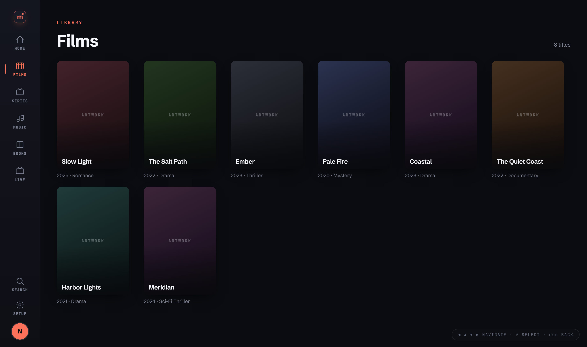
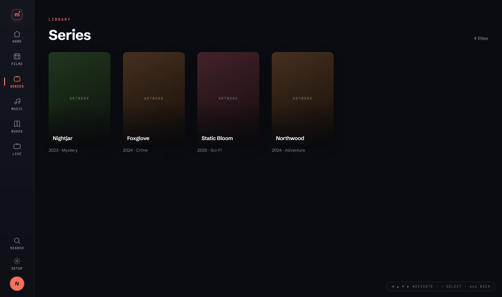
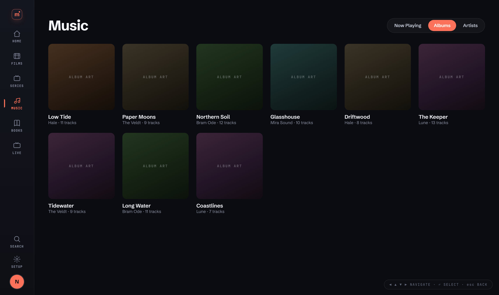
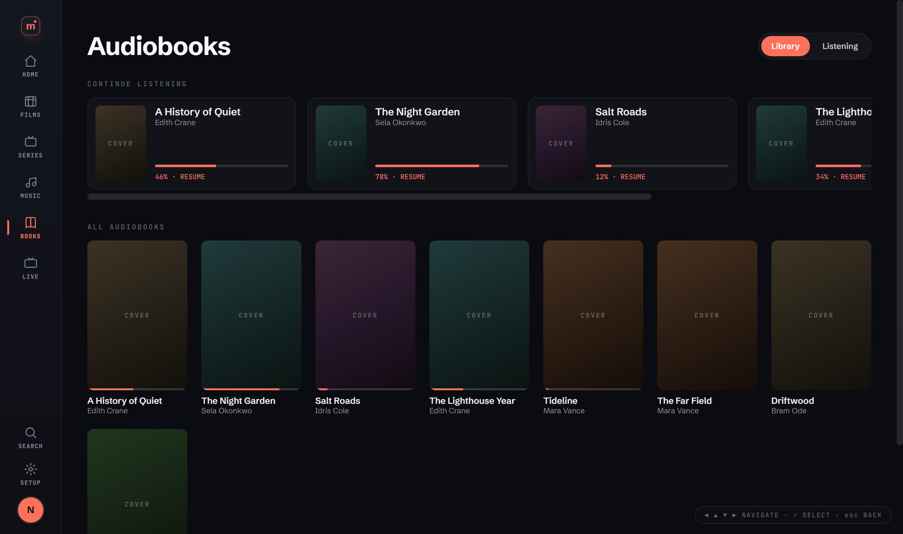
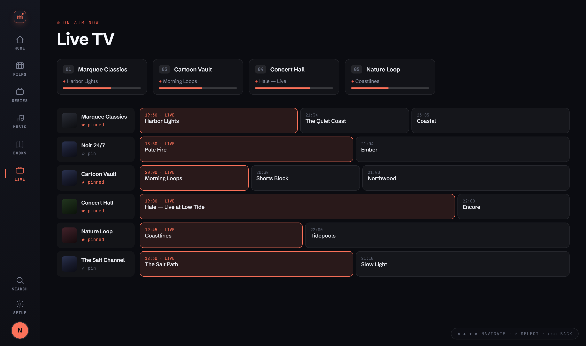
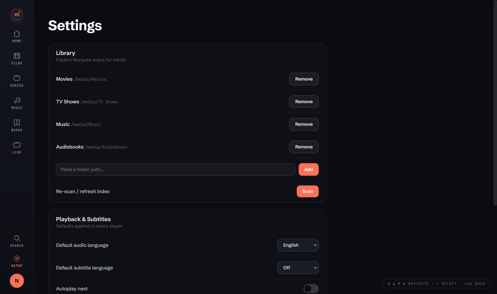

<p align="center">
  
</p>

<h1 align="center">Nedflix</h1>

<p align="center">
  <strong>Your personal media streaming platform</strong><br>
  One interface — <strong>Marquee</strong> — across Web, Desktop, Mobile &amp; TV
</p>

<p align="center">
  
  
  
  
  
</p>

---

## Screenshots

The **Marquee** interface — one redesigned UI shared across every platform, built for both
mouse and 10-foot gamepad navigation.

<p align="center">
  
</p>

| Films | Series | Music |
|:---:|:---:|:---:|
|  |  |  |
| **Audiobooks** | **Live TV** | **Settings** |
|  |  |  |

> Artwork shows the design's gradient placeholders; real posters/art come from local image
> files, embedded tags, or a metadata provider (TMDB / iTunes) at runtime.

---

## Features

- **Unified interface** — the Marquee UI runs on web, desktop, mobile, and TV from one codebase
- **Multi-user & profiles** — accounts with permissions; per-profile resume & accent
- **Everything in one place** — Movies, TV, Music, and Audiobooks with metadata
- **Live TV (IPTV)** — M3U playlists with XMLTV EPG; auto-channels via [ErsatzTV](https://ersatztv.org/)
- **Automatic subtitles** — OpenSubtitles integration
- **Gamepad / 10-foot ready** — full controller + spatial focus navigation
- **Audio visualizer** — multiple modes for music playback

---

## Quick Start

### Docker (web server)

```bash
git clone https://github.com/sp00nznet/nedflix.git
cd nedflix
cp .env.example .env          # edit with your credentials
docker compose up -d          # builds the Marquee web UI into the image
# Access at https://localhost:3443
```

### Web UI (development)

```bash
cd web
npm install
npm run dev                   # http://localhost:5173, proxies the API to a running server
npm run build                 # -> web/dist (served by the server / bundled into desktop & mobile)
```

### Desktop (Windows / Linux / macOS)

```bash
cd desktop
npm install
npm start                     # run the app
npm run build                 # package an installer into desktop/dist
```

### Mobile (Android / iOS)

```bash
cd mobile                     # Capacitor shell wrapping the web build
npm install
npm run add:ios && npm run add:android
npm run ios   # / npm run android
```

---

## Platforms

| Platform | Directory | Stack | Notes |
|----------|-----------|-------|-------|
| **Web (Docker)** | `/` + `/web` | Node + React/Vite | Full features, PostgreSQL, ErsatzTV |
| **Desktop** | `/desktop` | Electron | Windows/Linux/macOS, gamepad, system tray |
| **Mobile** | `/mobile` | Capacitor + `/marquee-native` | iOS + Android wrap the web build |
| **Android TV** | `/androidtv` | Android SDK | 10-foot UI |
| **Apple TV** | `/appletv` | Swift / Xcode | 10-foot UI |

All clients render the same **Marquee** UI (`/web`). Older/retired targets (Xbox, retro
console homebrew) live in [`/legacy`](legacy/README.md). The original native iOS/Android
apps, replaced by the Capacitor shell, are kept in `/archive`.

---

## Gamepad Controls

| Button | Action |
|--------|--------|
| **A** | Select |
| **B** | Back |
| **X / Start** | Play/Pause |
| **Y** | Fullscreen |
| **LB / RB** | Prev/Next |
| **LT / RT** | Volume |
| **D-Pad / Stick** | Navigate |

---

## Configuration

### Environment variables (Docker)

| Variable | Description |
|----------|-------------|
| `SESSION_SECRET` | Session encryption key |
| `ADMIN_USERNAME` / `ADMIN_PASSWORD` | Local admin credentials |
| `NFS_MOUNT_PATH` | Media library path |
| `ERSATZTV_URL` | ErsatzTV API URL |
| `GOOGLE_CLIENT_ID` | OAuth (optional) |
| `OPENSUBTITLES_API_KEY` | Subtitles (optional) |
| `OMDB_API_KEY` | Metadata (optional) |

### Desktop settings

Configure in the Settings panel: media folders, IPTV (M3U + XMLTV, URL or local file),
ErsatzTV, artwork provider (TMDB key — optional), default audio/subtitle language, accent.
Config is stored at `%APPDATA%/nedflix-desktop/` (Windows) or `~/.config/nedflix-desktop/` (Linux).

---

## Documentation

- **[docs/SETUP.md](docs/SETUP.md)** — SSL, OAuth, ErsatzTV, user management, troubleshooting
- **[web/README.md](web/README.md)** — the Marquee web app (structure, focus engine, API)
- **[mobile/README.md](mobile/README.md)** — Capacitor build steps and native bridge
- **[design/](design/)** — the original design handoff, specs, and prototypes

---

## Project Structure

```
nedflix/
├── server.js              # Express API + serves the Marquee web build (web/dist)
├── marquee-service.js     # profiles, resume, music, audiobooks, library, favorites
├── db.js, *-service.js    # database + media / metadata / iptv / ersatztv services
├── docker-compose.yml     # Docker orchestration
├── web/                   # ★ Marquee UI — React + TypeScript + Vite (the single front-end)
├── desktop/               # Electron shell (loads web/dist) + local-library API
├── mobile/                # Capacitor shell (iOS + Android) wrapping web/dist
├── marquee-native/        # native bridge plugin (background audio, lock-screen, cast…)
├── androidtv/  appletv/   # TV apps
├── public/                # legacy web client + server-rendered login
├── archive/               # retired native iOS/Android apps
├── legacy/                # Xbox + retro console ports (no longer targeted)
└── docs/                  # documentation
```

---

## License

Open source for personal and educational use.

<p align="center">
  <sub>Built for movie nights</sub>
</p>
